# GreenMart — Complete Grocery App UI in Flutter

> A full, production-ready Flutter UI for a grocery shopping app — from onboarding to checkout.  
> **UI only. Clean code. Ready to connect to any backend or API.**

---

## What's inside

This is not a demo. GreenMart covers every screen a real grocery app needs:

| Flow | Screens |
|---|---|
| Onboarding & Auth | Splash, Welcome, Login, Sign Up, Phone & OTP Verification |
| Shopping | Home, Categories, Product Listing, Product Detail |
| Categories | Fruits & Vegetables, Dairy & Eggs, Meat & Fish, Bakery, Beverages, Cooking Oil |
| Purchase | Cart, Checkout, Order Confirmed |
| User | Profile, Favorites, Search |

**17+ screens. Zero backend required.**

---

## Screenshots

### Onboarding & Authentication

| Splash | Welcome | Login |
|:---:|:---:|:---:|
|  |  |  |

| Sign Up | Phone Verification | OTP |
|:---:|:---:|:---:|
|  | 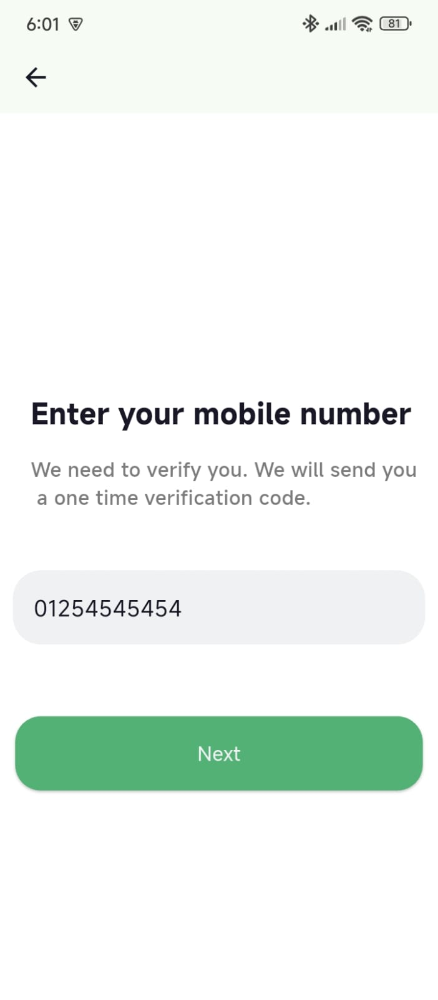 | 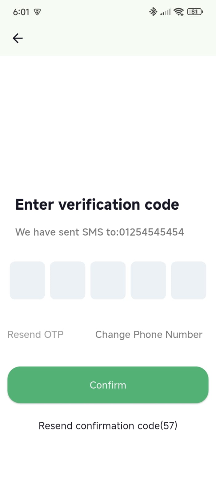 |

### Shopping Experience

| Home | Categories | Search |
|:---:|:---:|:---:|
| 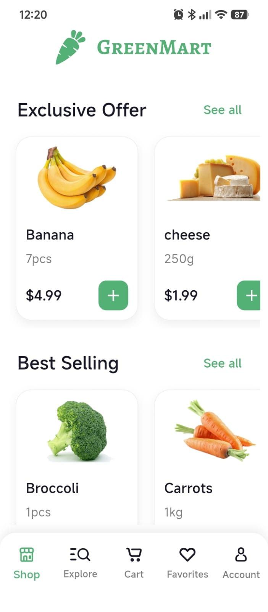 | 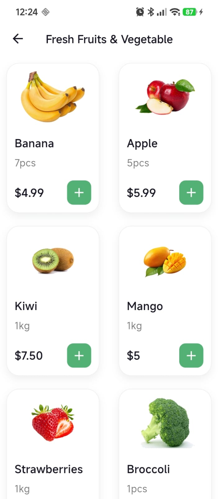 | 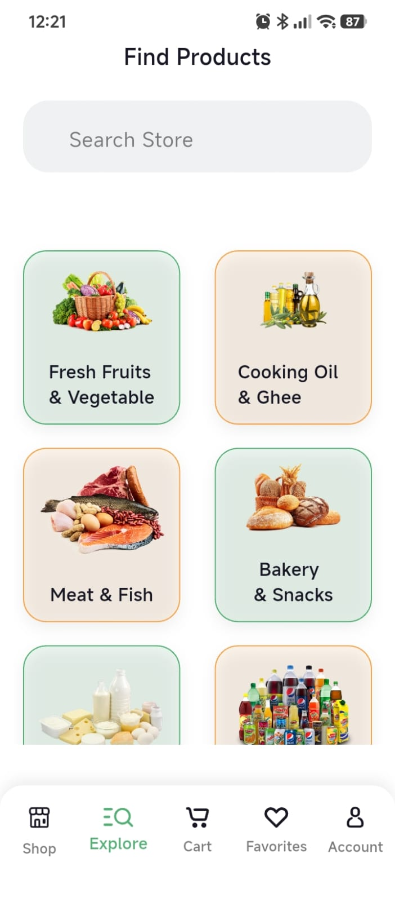 |

| Product Detail | Product Detail | Best Selling |
|:---:|:---:|:---:|
| 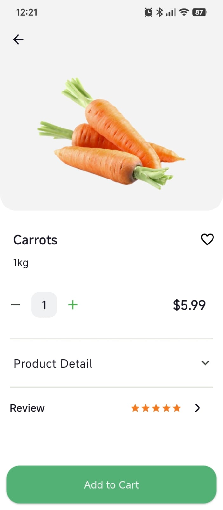 | 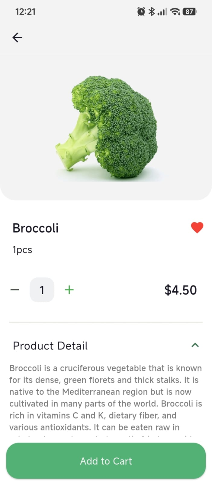 | 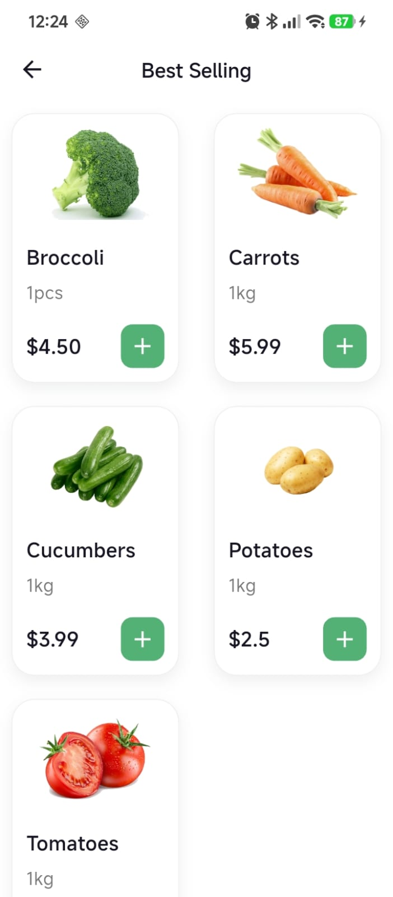 |

### More Categories

| Dairy & Eggs | Meat & Fish | Bakery & Snacks |
|:---:|:---:|:---:|
|  |  |  |

| Beverages | Cooking Oil | Exclusive Offers |
|:---:|:---:|:---:|
| 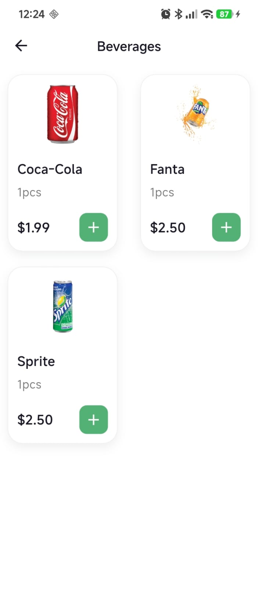 | 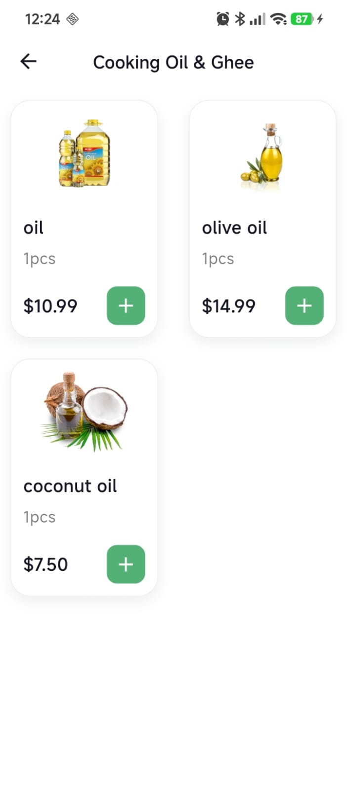 | 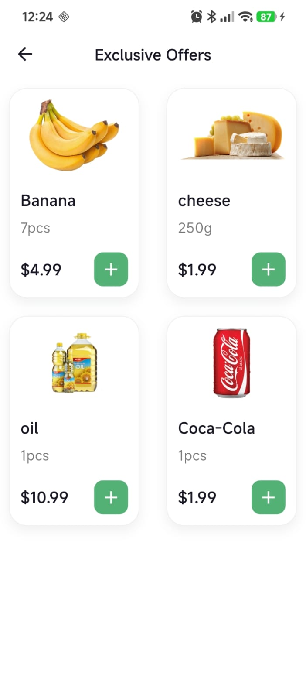 |

### Cart & Checkout

| Cart | Checkout | Order Confirmed |
|:---:|:---:|:---:|
|  |  | 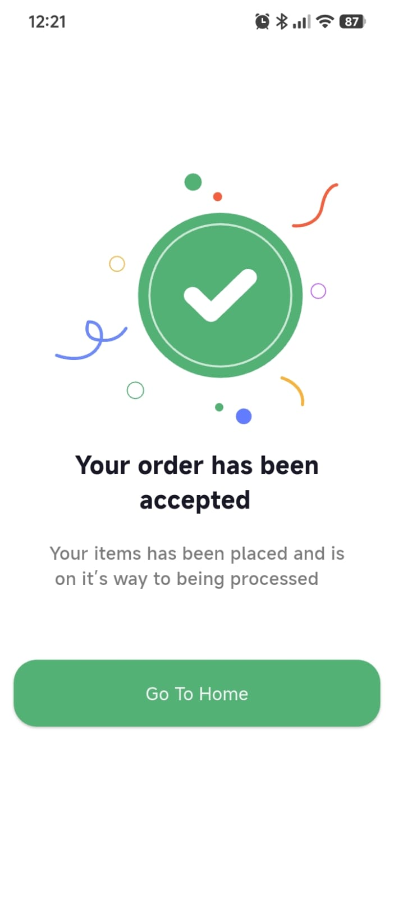 |

### User

| Profile | Favorites |
|:---:|:---:|
| 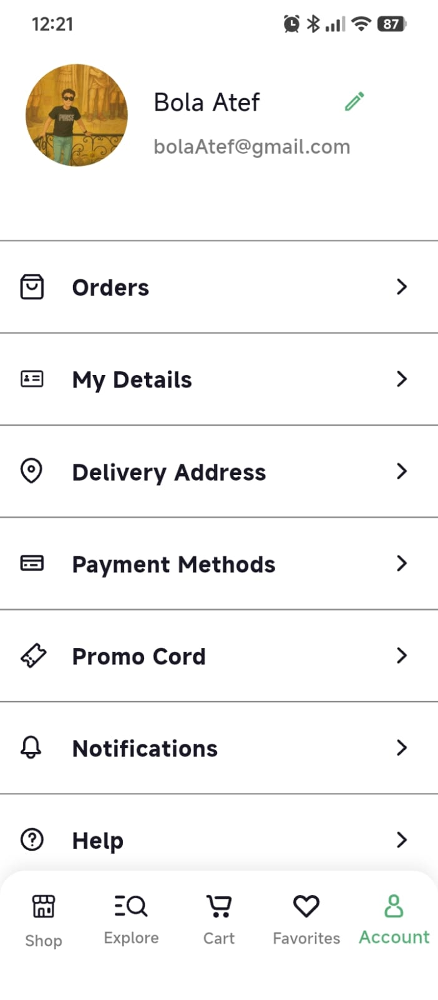 | 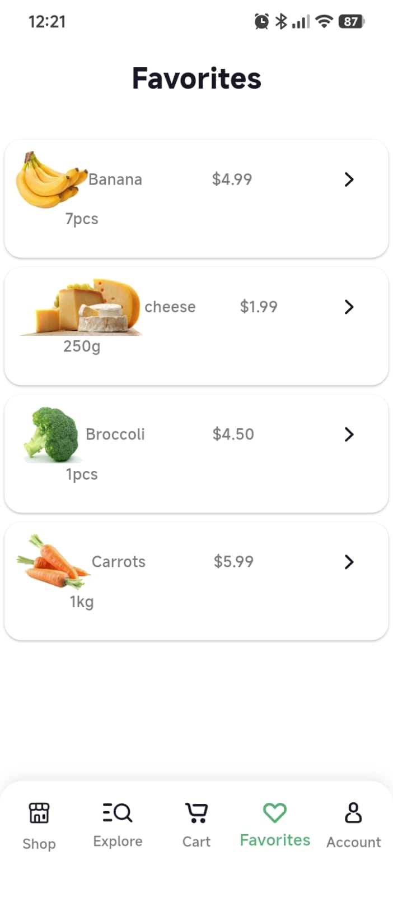 |

---

## Tech stack

| | |
|---|---|
| Framework | Flutter 3.x |
| Language | Dart |
| State management | Ready for Provider / Riverpod / Bloc |
| Backend | UI only — connect any REST API or Firebase |